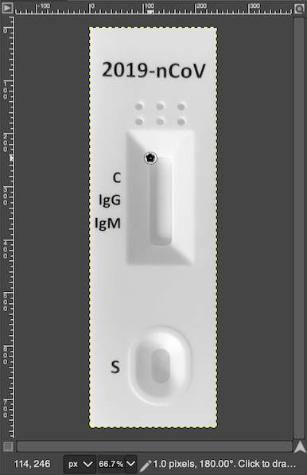
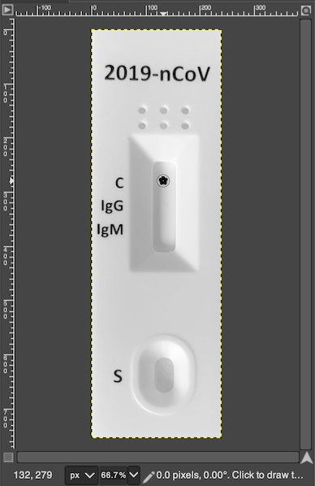
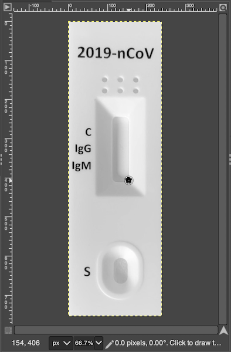
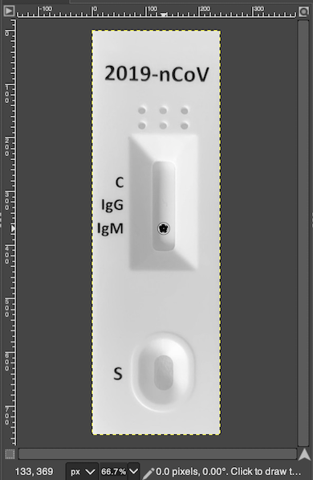

# Configuration for New RDTs
Please follow the instruction to add new RDTs to the app.

### 1. Getting a suitable template
RDTScan requires a clear, upright, and tightly cropped image of an unused RDT. Below are some examples of good and bad images:

Good Exmaple               |  Bad Example 1            |  Bad Example 2            |  Bad Example 3            |  Bad Example 4
:-------------------------:|:-------------------------:|:-------------------------:|:-------------------------:|:-------------------------:

 | 

 | 

| 

| 

|
Cropped and perspective corrected.   |  Too far away. Background included. | Only a part of RDT is shown.  | Only a part of RDT is shown. | RDT is skewed.

There are two ways to get such an image:
1. Use a document scanning app like [OfficeLens](https://play.google.com/store/apps/details?id=com.microsoft.office.officelens&hl=en). As long as the RDT is on a clean and distinct background, the app will perform perspective correction and crop the image tightly around the RDT. 
2. Take a photo yourself using a camera. The camera should be as parallel to the RDT as possible (i.e., each corner of the RDT should be 90&deg;). Open up the photo in an image-editing program (e.g., PhotoShop, GIMP) and crop the image as close to the RDT's edges as possible.

Once you have the template image, add it to the following folder in your Android code: `app/src/main/res/drawable/nodpi/`.

### 2. Identifying regions of interest
When trained clinicians look at an RDT design, they can usually quickly infer where test results should appear on the RDT and what they should mean. Currently, RDTScan needs developers to provide that information to bootstrap the algorithm. This information includes:

| Result Window                       | Control/Test Lines          |
| :---------------------------------- | :-------------------------: |
|       |       |
|               |    |
|               | |
|                                     | |

* TODO
*TODO: open in image editor*
*TODO: image showing different regions of interest*
*TODO: image showing how to find pixel locations for one of those regions of interest*

### 3. Modifying the configuration file
If you are working directly on our repository, open the file `app/src/main/assets/config.json`. If not, copy that file over to oyr file 
3. Key is the name of the RDT, and add the parameters specified in config.json

| **Data Field**                      | **Required?**       | **Data Types**       | **Range**    | **Description**    |
| :---------------------------------- | :-----------------: | :------------------- | :----------- |:----------------- |
| `REF_IMG`                           | :heavy_check_mark:  | `String`             |              | The filename of the template image for the RDT |
| `VIEW_FINDER_SCALE_H`               | :heavy_check_mark:  | `double`             | (0.0, 1.0)   | Height of the view finder compared to screen height in ratio |
| `VIEW_FINDER_SCALE_W`               | :heavy_check_mark:  | `double`             |              | Width of the view finder compared to screen height in ratio |
| `RESULT_WINDOW_RECT_TOP_LEFT`       | :heavy_check_mark:  | [`double`, `double`] |              | (x, y) coordinates of top-left corner of result window |
| `RESULT_WINDOW_RECT_BOTTOM_RIGHT`   | :heavy_check_mark:  | [`double`, `double`] |              | (x, y) coordinates of bottom-right corner of result window |
| `TOP_LINE_POSITION`                 | :heavy_check_mark:  | `double`, `double`] |              | (x, y) coordinates of the center of the top line |
| `MIDDLE_LINE_POSITION`              | :heavy_check_mark:  | `double`, `double`] |              | (x, y) coordinates of the center of the middle line |
| `BOTTOM_LINE_POSITION`              | :heavy_check_mark:  | `double`, `double`] |              | (x, y) coordinates of the center of the bottom line |
| `LINE_SEARCH_WIDTH`                 | :heavy_check_mark:  | `double`             |              | Gap between two consecutive lines |
| `TOP_LINE_NAME`                     | :heavy_check_mark:  | `String`             |              | The meaning of the top line (e.g., "Control", "Influenza A") |
| `MIDDLE_LINE_NAME`                  | :heavy_check_mark:  | `String`             |              | The meaning of the middle line (e.g., "Control", "Influenza A") |
| `BOTTOM_LINE_NAME`                  | :heavy_check_mark:  | `String`             |              | The meaning of the bottom line (e.g., "Control", "Malaria P.f") |
| `LINE_INTENSITY`                    | :heavy_minus_sign:  | `int`                | (0, 255)     | Minimum intensity of the line. The default value is 80. If you the reader to read more faint line, you can decrease the values. However, it will also increase false positive. If you experience the reader is showing too many false positive results, you can increase the value. |
| `FIDUCIAL_COUNT`                    | :heavy_minus_sign:  | `double`             |              | TODO |
| `FIDUCIAL_DISTANCE`                 | :heavy_minus_sign:  | `double`             |              | TODO |
| `FIDUCIAL_POSITION_MIN`             | :heavy_minus_sign:  | `double`             |              | TODO |
| `FIDUCIAL_POSITION_MAX`             | :heavy_minus_sign:  | `double`             |              | TODO |
| `FIDUCIAL_MIN_HEIGHT`               | :heavy_minus_sign:  | `double`             |              | TODO |
| `FIDUCIAL_MIN_WIDTH`                | :heavy_minus_sign:  | `double`             |              | TODO |
| `FIDUCIAL_MAX_WIDTH`                | :heavy_minus_sign:  | `double`             |              | TODO |
| `FIDUCIAL_TO_RESULT_WINDOW_OFFSET`  | :heavy_minus_sign:  | `double`             |              | TODO |

